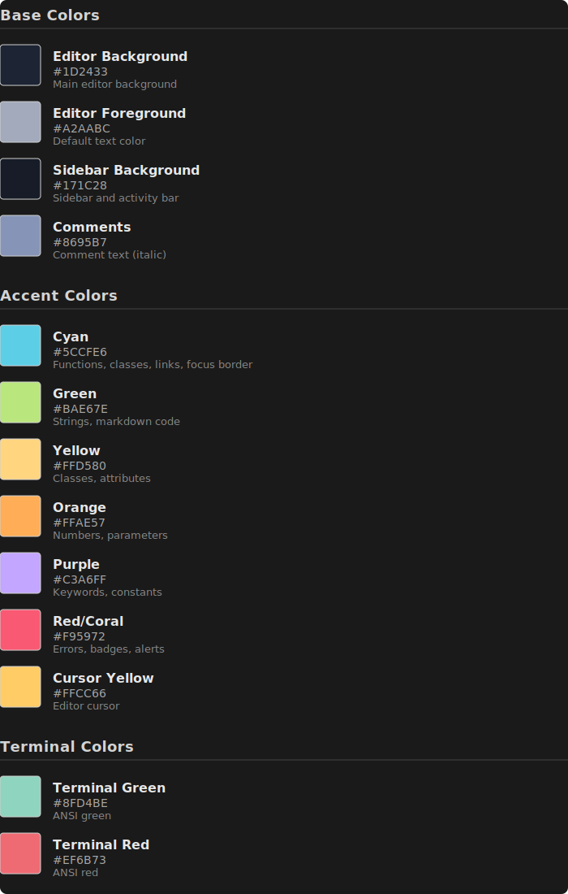

# Halcyon Theme

A dark, calming color theme for Visual Studio Code inspired by oceanic twilight.


## Description

Halcyon is a carefully crafted dark theme featuring soothing blues, cyans, and purples with just enough contrast to keep your eyes comfortable during long coding sessions. The color palette is designed to reduce eye strain while maintaining excellent syntax highlighting clarity.

## Color Palette



## Installation

### From VS Code Marketplace

1. Open VS Code
2. Go to Extensions (Cmd+Shift+X / Ctrl+Shift+X)
3. Search for "Halcyon Theme"
4. Click Install
5. Select the theme: Cmd+K Cmd+T / Ctrl+K Ctrl+T and choose "Halcyon Theme"

### Manual Installation

1. Clone or download this repository
2. Copy the folder to your VS Code extensions directory:
   - **macOS/Linux**: `~/.vscode/extensions/`
   - **Windows**: `%USERPROFILE%\.vscode\extensions\`
3. Reload VS Code
4. Select the theme: Cmd+K Cmd+T / Ctrl+K Ctrl+T and choose "Halcyon Theme"

## Development

Want to customize the theme?

1. Clone this repository
2. Open the folder in VS Code
3. Press **F5** to launch Extension Development Host
4. Edit `themes/Halcyon.json` to modify colors
5. Reload the Extension Development Host (Cmd+R / Ctrl+R) to see changes

## Screenshots

*Note: Will at some point -> Add screenshots of the theme in action with different languages*

## Supported Languages

Halcyon provides enhanced syntax highlighting for:
- JavaScript/TypeScript
- Python
- HTML/CSS
- JSON
- Markdown
- And many more!

## Recommended Settings

For the best experience with Halcyon, consider these settings:

```json
{
  "editor.fontFamily": "JetBrains Mono, Fira Code, Consolas, monospace",
  "editor.fontSize": 14,
  "editor.lineHeight": 1.6,
  "editor.fontLigatures": true,
  "editor.cursorBlinking": "smooth",
  "editor.cursorSmoothCaretAnimation": "on"
}
```

## Credits

Created by Peter Giannopoulos

## License

ISC License - see LICENSE file for details

## Contributing

Found a bug or have a suggestion? Please open an issue on GitHub!

## Changelog

See [CHANGELOG.md](CHANGELOG.md) for version history.
